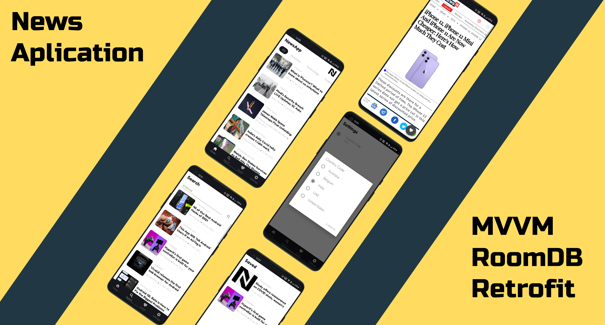

# NewsApplication

News Application using MVVM, RoomDB, Navigation Graph and Retrofit2.

### Download : [Get apk][apk-download]

### Tech

- [MVVM Architecture][mvvm]: To enable clean architecture
- [Room Database][room-db]: To mark favorite news and store in DB 
- [Navigation Graph][navigation-graph]: To make fragment navigation easy
- [Retrofit][retrofit]: To makes api call 

### News API: https://newsapi.org/

[apk-download]: app/release/app-release.apk
[room-db]: https://developer.android.com/reference/android/arch/persistence/room/RoomDatabase
[mvvm]: https://developer.android.com/jetpack/guide#recommended-app-arch
[navigation-graph]: https://developer.android.com/guide/navigation/navigation-design-graph
[retrofit]: https://square.github.io/retrofit/